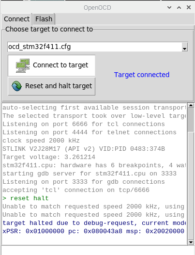
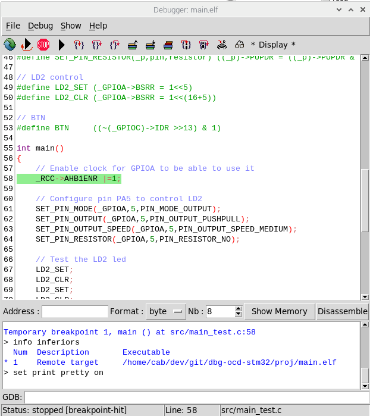

# dbg-ocd-stm32

(C) 2015-2021 Eric Boucharé (ebcfr)


## What is it?

Simple tools to setup C/asm projects on STM32F4x microcontroller using
OpenOCD and the arm-none-eabi-gcc/gdb toolchain, away from big IDEs.

The package provides

* [ocd](#ocd) : a simple box to select openocd scripts or custom scripts
* [dbg](#dbg) : a graphical frontend to the gdb debugger
* a [sample STM32 project](proj/) to demonstrate the sdk use


## Install

The install targets Linux (debian, ubuntu, raspbian)

* install tcl tk

	```
	sudo apt install tcl tk
	```
	
* install gcc/gdb and openocd

	```
	sudo apt install make binutils-arm-none-eabi gcc-arm-none-eabi gdb-multiarch libnewlib-arm-none-eabi libnewlib-nano-arm-none-eabi
	sudo ln -sf /usr/bin/gdb_multiarch /usr/bin/arm-none-eabi-gdb
	```

	Alternatively, one can use the [ARM embedded toolchain](https://developer.arm.com/tools-and-software/open-source-software/developer-tools/gnu-toolchain/gnu-rm) provided by ARM.
	
* install the sdk

	- system wide 
		
		```
		sudo cp sdk/bin /usr/local/bin/
		sudo cp -r sdk/share/ocd /usr/local/share/
		```
	
	- or local (nothing to do)
	
* edit `proj/setup.sh`
	
	to reflect the sdk install place. The default is set for sdk local use.
	
	```
	#!/bin/sh

	export SDK=$PWD/../sdk
	export PATH=$SDK/bin:$PATH
	```
	
	One may add the path to the compiler bin directory if arm-none-eabi-gcc/gdb 
	and openocd are not in the PATH.


## Quick start

* Open a terminal at the stm32 project root

* Setup the env variable to access tools

	```
	. setup.sh
	```

	(don't forget the '.' and the ' ' in front of setup.sh)

* connect to the board

	```
	ocd &
	```
	
* compile

	```
	make
	```
	It should provide `main.elf` at the root of the project.
	
* load to the target

	```
	dbg main.elf &
	```

	You should be on the first line of the `main` function.
	
* read variable, set breakpoints, step instructions, run the program using icons or through the GDB command line


<a id="ocd"></a>
## About ocd

This is just a helper box to connect to a board using openocd and reset it.
The openocd log is displayed in a window while the entry provides a way to 
interact with openocd directly, which can be useful while testing the 
connection or writing a new connection script.

<p align="center"></p>

The box provides two panes

* a connect pane which allows you to select the target.

	The target list is made of target config files (`.cfg` files) 
	
	* in the `config ` directory in the current directory (so that ocd should be run from the project root directory)
	* in the `~/.ocd/scripts/`. These scripts are copied from $SDK/share/ocd/scripts/ the first time the program is used.
	* in the openocd distribution.
	
	One can set a custom script using definitions in the openocd distribution. Here the example for a STM32F411 script
	
	```
	# get the interface and target in the openocd distribution
	source [find interface/stlink.cfg]
	set CHIPNAME stm32f411
	set WORKAREASIZE 0x20000
	source [find target/stm32f4x.cfg]
	```

	At connection, the config file, the selected file is copied in 
	`~/.ocd/scripts/` with a starting '_', which allow you to get easily the 
	config files from the openocd distrib, rename and modify the initial script 
	for our own use. Selected files are remembered when ocd is terminated.
	
	The `Reset and halt target` button, a `cpu_reset_halt` generates a `reset halt` 
	command. If the microcontroller doesn't halt, the configuration script should
	provide the `reset-end` hook to help the microprocessor halting.
	
	```
	$_TARGETNAME configure -event reset-end {
		
	}
	```
	
* a flash pane, which should allow you to flash a file to be selected to the microcontroller through openocd (not needed for the STM32 project).


<a id="dbg"></a>
## About dbg

It's a graphical frontend to the gdb debugger. The program can actually be 
used to debug standard or microcontroller programs. 

<p align="center"></p>

It uses a config file named `.dbginit` (hidden file) which have to be at the 
root of the project. For example, for the STM32 project, we have

```
#! arm-none-eabi-gdb
open lib/*.c
target extended-remote localhost:3333
load
monitor reset halt
tbreak main
continue
```

The first line, starting with `#!` tells us about the debugger used (which 
must be in the PATH).

The second line allows to pre-add to the file menu some source file, to be 
able to setup breakpoints for example. When debugging, new entered files are 
appended to the file menu.

The remainder are just standard gdb commands, here just to say how to connect
to openocd (port 3333), to download the code to the target flash memory and to
setup break point on the main function so that we get started from here (and 
all the pre-main initialization code will be executed).

The program is aimed to ease the use of gdb, not replace it. So it doesn't do 
what gdb does perfectly well.

One can use [gdb commands](proj/docs/refcard.pdf) as usual.

```
# print a register in decimal/hexa/binary
print $r0
p $r0
p/x $r0
p/t $r0
p $pc

# same for variables
p/x myvar

# control execution
step
continue
# ^C to halt the program
```

One can toggle breakpoints easily by double-click on the line.

Peripheral registers can be accessed through their pointer which have a '_' 
prefix. Names follow the conventions established by the microcontroller 
datasheet.

```
p/x *_GPIOA
p/x _GPIOA->MODER
```

Finally, the program uses the same shortcuts than Eclipse does (F5=step into,
F6=step over, F7=Finnish, F8=continue).
